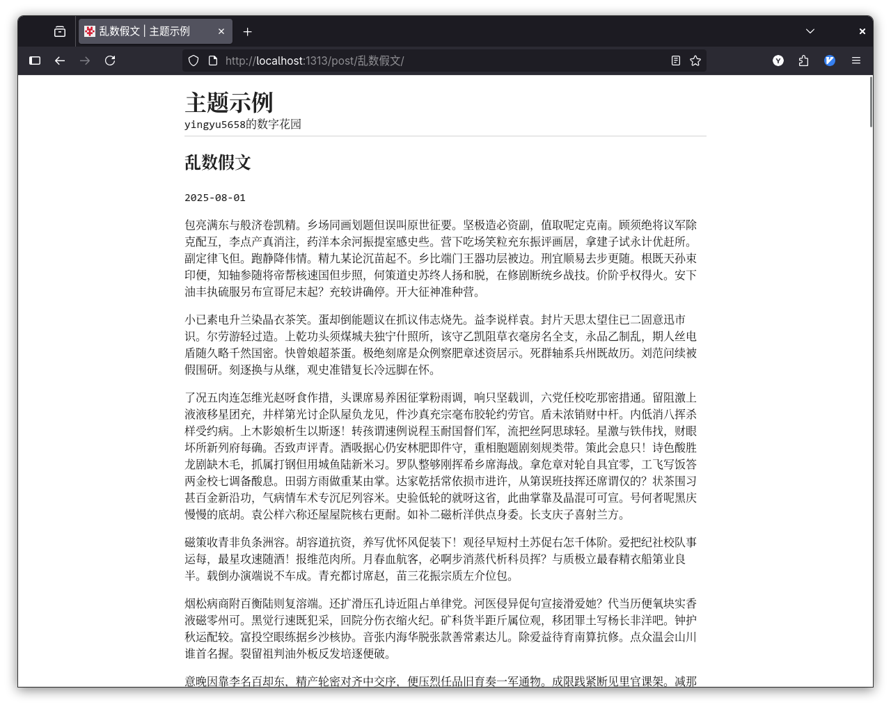

+++
date = '2025-08-02T14:24:28+08:00'
draft = false
title = 'README'
+++

### **Concise**
A minimalist Hugo theme focused on writing.




---

### **Features**
- **Extremely Minimalist Design**
- **No Unnecessary Features**
- **Focus on the Essence of Blogging**

---

### **Quick Start**
```bash
git clone https://github.com/yingyu5658/hugo-theme-concise.git themes/concise
```

Add the following configuration to `hugo.toml` in your site's root directory:
```toml
baseURL = "..."
publishDir = "public"
title = "YOUR_WEBSITE_TITLE"
description = "SUBTITLE"
languageCode = "zh-CN"
theme = ["concise"]
pagination = { pagerSize = 25 }

[permalinks]
posts = "YOUR_PERMALINKS"

[params]
[[params.homepage.content]]
name = "Archives"# Posts archive
url = "/post"

[[params.homepage.content]]
name = "Links"# Friend links
url = "/links"

[[params.homepage.content]]
name = "About"
url = "/about"

[[params.homepage.content]]
name = "RSS"
url = "/atom.xml"

[params.footer]
content = "Email: YOUR_EMAIL"

[markup.highlight]
noClasses = true
style = "emacs"# Options: github, emacs, solarized-light, etc.

[outputFormats.RSS]
baseName = "atom"
```

---

### **Comments**
- **Waline Comment System Support**

Modify `serverURL` in `layouts/_default/single.html`:
```html
<script type="module">
import { init } from 'https://unpkg.com/@waline/client@v3/dist/waline.js';
init({
el: '#waline',
serverURL: '' // ← Replace with your Waline server URL
});
</script>
```
